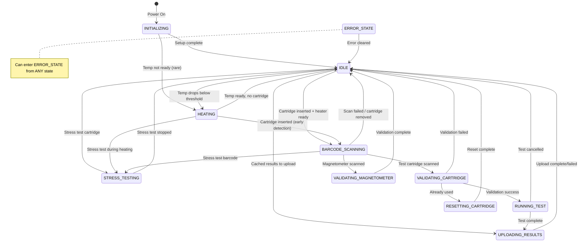

# Legacy Firmware State Transition Analysis

This document provides a comprehensive analysis of all state transitions in the legacy Brevitest firmware. Each transition is documented with:
- Trigger conditions
- Guard conditions
- Actions performed
- Legacy code reference

**CRITICAL**: Any new implementation must match this behavior exactly.

---

## State Diagram (Mermaid)



---

## State: INITIALIZING

**Purpose**: Device startup and hardware initialization.

**Entry Actions** (setup() function):
1. Serial.begin(115200), wait for connection
2. Initialize cartridge detector pin (INPUT_PULLUP)
3. Initialize all hardware pins
4. Register Particle cloud variables and functions
5. Setup EEPROM
6. Create directories: /cache, /buffer, /validation, /assay
7. Attach cartridge detector interrupt
8. Initialize I2C and spectrophotometer
9. Reset stage to home position
10. Test LEDs and buzzer
11. Start temperature control

**Exit Transitions**:

| Target | Trigger | Guard | Actions | Legacy Reference |
|--------|---------|-------|---------|------------------|
| IDLE | Setup complete | Always | Log "Setup complete" | brevitest-firmware.ino:4867 |
| HEATING | Temp not ready | heater_ready == false | Start heating | Rarely used |

---

## State: IDLE

**Purpose**: Normal standby state, ready for cartridge insertion.

**Active Behaviors**:
- LED: Green fade if heater ready + no cartridge
- LED: Green blink if cartridge present (remove signal)
- LED: Red solid if heater not ready
- Buzzer: Alert if test just uploaded and cartridge present
- No buzzer if no cartridge or cartridge present without recent test

**Exit Transitions**:

| Target | Trigger | Guard | Actions | Legacy Reference |
|--------|---------|-------|---------|------------------|
| BARCODE_SCANNING | Cartridge inserted | heater_ready && can_transition_to() | reset_stage(), move_to_test_start, buzzer | hardware_loop():5330-5336 |
| HEATING | Temp drops | !heater_ready | Continue temp control | Implicit |
| STRESS_TESTING | Stress barcode | stress test cartridge detected | Begin stress test | barcode_scan_loop() |
| UPLOADING_RESULTS | Cached test | test_in_cache() | Start upload | loop() check |
| ERROR_STATE | Error condition | Always allowed | Store error message | set_error() |

---

## State: HEATING

**Purpose**: Waiting for heater to reach target temperature.

**Active Behaviors**:
- LED: Red solid (don't touch) if no cartridge
- LED: Green blink (remove) if cartridge present - signals rejection
- Buzzer: OFF (device not ready)
- PID temperature control active
- Can perform early barcode scanning

**Critical Behavior - Cartridge Rejection**:
When a cartridge is inserted during HEATING:
1. Scan barcode immediately (early detection)
2. Store barcode in pending_barcode_uuid
3. Set pending_barcode_available = true
4. Signal user to REMOVE cartridge (green blink, no buzzer)
5. DO NOT validate - cartridge is rejected
6. Stay in HEATING mode
7. When heater ready, if cartridge still present, allow re-scan

**Legacy Reference**: brevitest-firmware.ino:5077-5100

**Exit Transitions**:

| Target | Trigger | Guard | Actions | Legacy Reference |
|--------|---------|-------|---------|------------------|
| IDLE | Heater ready | heater_debounced() && !detector_on | None | Implicit |
| BARCODE_SCANNING | Cartridge in during heating | detector_on && mode==HEATING | Set cartridge_state=DETECTED | hardware_loop():5321-5328 |
| BARCODE_SCANNING | Heater ready + pending barcode | heater_debounced() && pending_barcode_available | Re-scan cartridge | loop():5807-5816 |
| ERROR_STATE | Error condition | Always allowed | Store error message | set_error() |

---

## State: BARCODE_SCANNING

**Purpose**: Reading barcode from inserted cartridge.

**Active Behaviors**:
- LED: Red solid (don't touch)
- Buzzer: OFF
- Only scans if heater_debounced() returns true

**Barcode Type Routing**:
- Length 36: Test cartridge → VALIDATING_CARTRIDGE
- Length 32 with "MAG-" prefix: Magnetometer → VALIDATING_MAGNETOMETER
- Length 16 with "STRESS-TEST-" prefix: Stress test → STRESS_TESTING
- Other: Error → IDLE

**Critical Behavior - Recently Tested Cooldown**:
If same barcode was tested within last 30 seconds (RECENT_TEST_COOLDOWN_MS):
- Skip validation
- Log "Cartridge still inserted after test completion"
- Stay in current state

**Legacy Reference**: brevitest-firmware.ino:5035-5200

**Exit Transitions**:

| Target | Trigger | Guard | Actions | Legacy Reference |
|--------|---------|-------|---------|------------------|
| VALIDATING_CARTRIDGE | Barcode read | type == CARTRIDGE | set_current_barcode(), cartridge_state = BARCODE_READ | barcode_scan_loop():5074-5140 |
| VALIDATING_MAGNETOMETER | Magnetometer barcode | type == MAGNETOMETER | Set barcode | barcode_scan_loop() |
| STRESS_TESTING | Stress test barcode | type == STRESS_TEST | Begin stress test | barcode_scan_loop() |
| HEATING | Cartridge during heating | previous_mode == HEATING | Store pending barcode, signal removal | barcode_scan_loop():5077-5100 |
| IDLE | Scan failed | barcode error or removed | Clear barcode | barcode_scan_loop() |
| ERROR_STATE | Error condition | Always allowed | Store error message | set_error() |

---

## State: VALIDATING_CARTRIDGE

**Purpose**: Cloud validation of cartridge UUID.

**Active Behaviors**:
- LED: Red solid (don't touch)
- Buzzer: OFF
- Cloud request with timeout and retry

**Critical Behavior - Validation Retry Logic**:
```
Timeout: 45000ms (VALIDATION_TIMEOUT_MS)
Max Retries: 3 (VALIDATION_MAX_RETRIES)
Backoff Base: 5000ms (VALIDATION_RETRY_BACKOFF_BASE)
Backoff Formula: base * retry_count

On Timeout:
1. Check if retry_count < max_retries
2. Increment retry_count
3. Calculate backoff: 5000 * retry_count
4. Set validation_retry_delay_until = millis() + backoff
5. Clear cloud_operation_pending
6. Wait for delay, then republish

On Max Retries Exceeded:
1. Set cartridge_state = INVALID
2. Set error "Cartridge validation timeout"
3. Clear retry tracking
4. Transition to ERROR_STATE

On Cloud Disconnect:
1. Clear cloud_operation_pending
2. Count as retry with backoff
3. Wait for reconnection
```

**Legacy Reference**: brevitest-firmware.ino:5528-5787

**Exit Transitions**:

| Target | Trigger | Guard | Actions | Legacy Reference |
|--------|---------|-------|---------|------------------|
| RUNNING_TEST | Validation success | response.valid == true | Load assay, start test | response_validate_cartridge() |
| RESETTING_CARTRIDGE | Already used | response.needsReset == true | Initiate reset | response_validate_cartridge() |
| IDLE | Cartridge removed | !detector_on | Clear retry tracking | loop():5537-5548 |
| ERROR_STATE | Timeout after max retries | retry_count >= max | Set cartridge_state = INVALID | loop():5650-5668 |
| ERROR_STATE | Validation failed | response.valid == false | Store error | response_validate_cartridge() |

---

## State: VALIDATING_MAGNETOMETER

**Purpose**: BLE magnetometer validation.

**Active Behaviors**:
- LED: Red solid (don't touch)
- BLE scanning for magnetometer device
- Stage movement for well readings

**Exit Transitions**:

| Target | Trigger | Guard | Actions | Legacy Reference |
|--------|---------|-------|---------|------------------|
| IDLE | Validation complete | All wells read | Save validation file | magnet_validation_loop() |
| IDLE | Validation failed | Timeout or error | Log error | magnet_validation_loop() |
| ERROR_STATE | Error condition | Always allowed | Store error message | set_error() |

---

## State: RUNNING_TEST

**Purpose**: Test execution via BCODE interpreter.

**Active Behaviors**:
- LED: Red solid (don't touch)
- BCODE execution in progress
- Heater PID control via BCODE_loop()
- Spectrophotometer readings
- Stage movement

**Critical Behavior - BCODE_loop()**:
Called periodically during BCODE execution to:
1. Run heater PID control
2. Check for cartridge removal
3. Abort test if cartridge removed (test_state = CANCELLED)

**Exit Transitions**:

| Target | Trigger | Guard | Actions | Legacy Reference |
|--------|---------|-------|---------|------------------|
| UPLOADING_RESULTS | Test complete | BCODE returns 99 | Calculate duration, checksum | process_BCODE() |
| IDLE | Cartridge removed | !detector_on | test_state = CANCELLED | BCODE_loop() |
| ERROR_STATE | Test error | BCODE error | Store error message | process_BCODE() |

---

## State: UPLOADING_RESULTS

**Purpose**: Upload test results to cloud.

**Active Behaviors**:
- LED: Red solid (don't touch)
- LED: Changes to green blink when upload complete (signal removal)
- Buzzer: Alert when upload complete and cartridge still present
- Cloud upload with timeout

**Critical Behavior**:
- 30 second timeout
- On failure, cache results to /cache/{cartridgeId}
- On success, set test_state = UPLOADED

**Exit Transitions**:

| Target | Trigger | Guard | Actions | Legacy Reference |
|--------|---------|-------|---------|------------------|
| IDLE | Upload complete | Response received | test_state = UPLOADED | response_upload_test() |
| IDLE | Upload timeout | 30s elapsed | Cache test, set error | loop():5512-5516 |
| ERROR_STATE | Upload failed | Error response | Store error | response_upload_test() |

---

## State: RESETTING_CARTRIDGE

**Purpose**: Cloud request to reset cartridge status.

**Active Behaviors**:
- LED: Red solid (don't touch)
- Cloud request with timeout

**Exit Transitions**:

| Target | Trigger | Guard | Actions | Legacy Reference |
|--------|---------|-------|---------|------------------|
| IDLE | Reset complete | Response received | Clear state | response_reset_cartridge() |
| IDLE | Reset timeout | 30s elapsed | Set error | loop():5479-5483 |
| ERROR_STATE | Reset failed | Error response | Store error | response_reset_cartridge() |

---

## State: STRESS_TESTING

**Purpose**: Automated repeated test cycles.

**Active Behaviors**:
- Cycles through test execution
- Tracks cycle count in EEPROM
- No user intervention needed

**Exit Transitions**:

| Target | Trigger | Guard | Actions | Legacy Reference |
|--------|---------|-------|---------|------------------|
| IDLE | Stress test stopped | User command or complete | Update EEPROM counters | stress_test_loop() |
| ERROR_STATE | Stress test error | Test failure | Store error | stress_test_loop() |

---

## State: ERROR_STATE

**Purpose**: Error condition requiring attention.

**Entry**: Can be entered from ANY state via set_error().

**Active Behaviors**:
- LED: Red solid OR green blink if invalid cartridge (signal removal)
- Buzzer: Problem pattern if invalid cartridge

**Exit Transitions**:

| Target | Trigger | Guard | Actions | Legacy Reference |
|--------|---------|-------|---------|------------------|
| IDLE | Error cleared | clear_error() called | Reset error state | clear_error() |

---

## Global Behaviors

### Always in hardware_loop() (every iteration):
1. Update heater_ready from temperature reading
2. Process cartridge detector debouncing (10ms)
3. Call set_device_indicators() for LED/buzzer
4. Run PID temperature control if enabled
5. Process buzzer timer triggers

### Always in loop() (every iteration):
1. Check cloud connection, re-register subscriptions if restored
2. Call process_serial_port()
3. Call hardware_loop()
4. Execute state-specific behavior

---

## Timing Critical Requirements

| Operation | Timing | Notes |
|-----------|--------|-------|
| Detector debounce | 10ms | Prevents false triggers |
| Heater ready debounce | 5000ms | Prevents false heater ready |
| Validation timeout | 45000ms | Configurable up to 60000ms |
| Validation retry backoff | 5000ms * count | Exponential backoff |
| Upload timeout | 30000ms | Fixed |
| Reset timeout | 30000ms | Fixed |
| Recent test cooldown | 30000ms | Prevents immediate re-scan |
| Motor step delay minimum | 250us | Hardware limit |
| Heater stabilization | 5000us | After analogWrite |

---

## Error Codes

| Code | Description | Recovery |
|------|-------------|----------|
| ERR_INVALID_STATE | Invalid state transition attempted | Log and ignore |
| ERR_VALIDATION_TIMEOUT | Cloud validation timeout | Retry or fail |
| ERR_CARTRIDGE_INVALID | Cartridge validation failed | Remove cartridge |
| ERR_HEATER_OVERTEMP | Heater exceeded max temp | Emergency shutdown |
| ERR_CLOUD_DISCONNECT | Lost cloud connection | Reconnect and retry |
